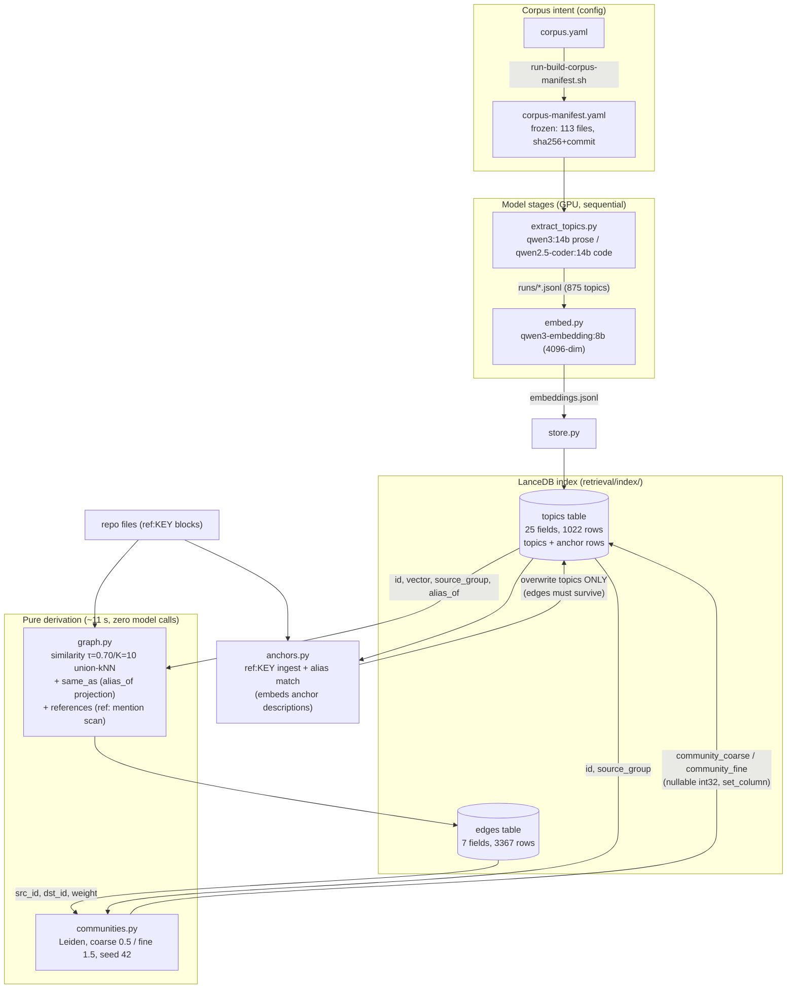

# LTG Data & Code Flow — Phase 4 Snapshot

First entry in a system-operation model collection: instead of prose-only docs,
each pipeline gets (1) a data-flow diagram and (2) an event-model-style
*stage × state matrix* showing what every stage reads, writes, and destroys.
The matrix view is the one that exposes composition bugs — the Phase 4
backup/edges-table data-loss finding (PR #66 review) is visible as a
column-clobber in the matrix below, invisible in per-stage prose.

<!-- ref:ltg-phase4-dataflow -->
## Pipeline data flow (Phases 2.5 → 4)

## Stage × state matrix (event-model view)

Rebuild order is **mandatory left-to-right**; each cell is the stage's effect
on that piece of state. `—` = untouched. This is the table to update when a
stage changes what it reads or writes.

| State ↓ / Stage → | store.py | anchors.py rebuild | graph.py build | communities.py |
|---|---|---|---|---|
| `topics` table | **overwrite** (topic rows, community cols null) | **overwrite** (topics + anchor rows re-derived; community cols nulled) | read only | **overwrite** (fills community cols only) |
| `edges` table | — | — (**must survive**: topics-only overwrite) | **overwrite** (full re-derivation) | read only |
| `index.bak` | **replaced** (copy of pre-run index) | **replaced** (copy) | — | **replaced** (copy) |
| model calls | none | anchor-description embeds | **none** | **none** |
| repo files read | none | ref:KEY blocks | ref:KEY blocks (mentions) | none |

Invariants the matrix encodes:

- **Community columns are derived data.** Any stage that overwrites `topics`
  nulls them; only `communities.py` fills them. Null = "not regenerated since
  the last topics overwrite" (P4-D5).
- **`edges` is derived data too** — regenerate via `run-graph.sh` after any
  anchors rebuild; consumers read relationships from `edges`, never `alias_of`
  (P4-D6).
- **Backups are copies, never moves** (post-PR-66-review fix): the live index
  dir always keeps both tables; a stage overwrites only the table(s) in its
  row above. `index.bak` is single-slot and shared by all stages — a later
  stage's backup replaces an earlier stage's rollback point (hardening: T-71).

## Edge kinds (edges table)

| edge_kind | weight | directed | derived from |
|---|---|---|---|
| `similarity` | cosine (≥ τ 0.70) | no | exact matmul over node vectors, union top-K=10 |
| `same_as` | 1.0 | no | `alias_of` column projection (M:N allowed) |
| `references` | 1.0 | yes | `ref:KEY` mentions inside anchor block bodies |
<!-- /ref:ltg-phase4-dataflow -->

## Extending this collection

Next candidates when a phase touches them: anchors alias-matching decision
flow (dual-path, 0.85 threshold, near-miss bands) and the Phase 5 `relate(a,b)`
read path. Keep one file per subsystem snapshot; update the matrix in the same
PR that changes stage behavior.
