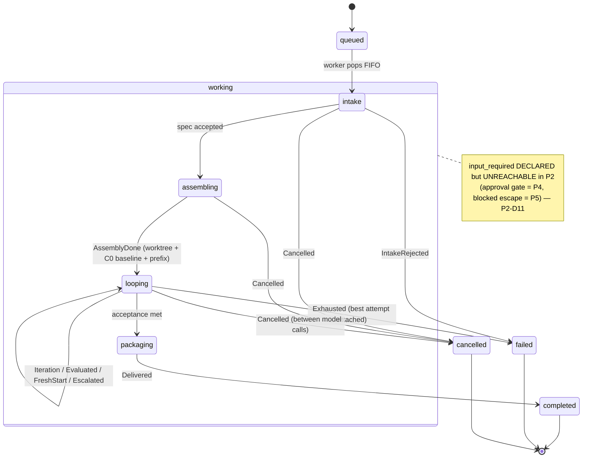
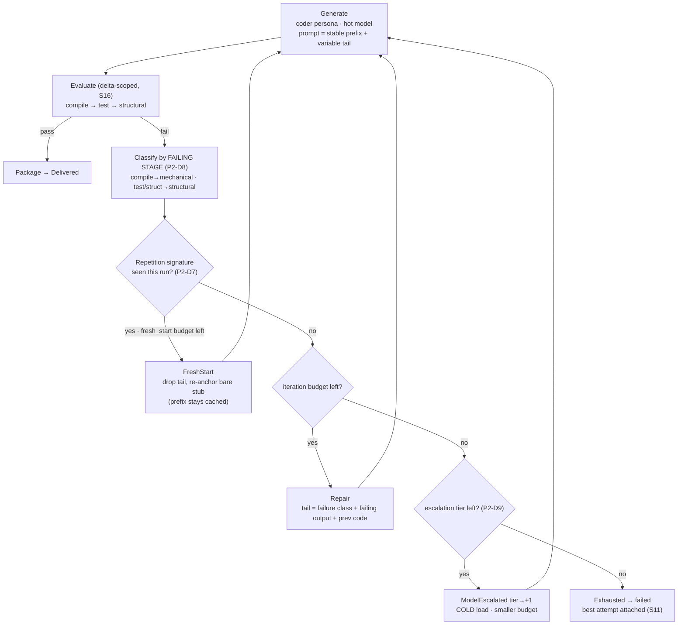

# oficina P2 — Evaluated deliverable loop (plan)

**Status: FROZEN 2026-07-15** (P2-D1–P2-D13 reviewed; freeze-review fixes to P2-D9 / event table /
acceptance-5; **post-freeze advisor pass** sharpened **P2-D12** (delta-scope masking hazard — the
blocking correctness fix), **P2-D8** (Python ERROR/FAILED split), **P2-D5** (worktree prune on
retention)). Task: **T-92**. Two items deferred with named triggers (P2-D6 keep_alive; P2-D9
tier-pairing table). First slice = P2-D1; build steps T1–T8 below. Vision: `docs/vision/coding-delegate/` (system name **oficina**,
V-D1). Phase contract: `ref:delegate-phasing` § P2. Loop anatomy: `ref:delegate-loop`.
Builds on P1 (T-84, BUILT+MERGED): the loop is a new `GenerateFn` filling the worker's
injectable `generate:` seam — additive, not a restructure.

<!-- ref:delegate-p2-goal -->
## Goal & scope

Replace P1's single-shot generation with the **coder ⇄ evaluator loop** (`ref:delegate-loop`):
generate → evaluate cheaply (every iteration) → classify failure → repair or fresh-start →
model-escalate → budget out. This is the value inflection — the point where a "run" is worth
submitting instead of calling `generate_code` inline. Attacks the measured defect distribution
(`ref:delegate-evidence-verdicts`): ~1/3 of "improved" + ~1/2 of "rejected" verdicts are
Phase-1-catchable, so the loop's first automated iteration converts them from "Claude fixes it"
to "nobody fixes it."

**What already exists that P2 reuses (scope de-risk):**
- **Evaluator Phase 1 is built.** Layer 4 COMPLETE (`ref:layer4-status`); `benchmarks/lib/validate-code.py`
  (Go build+vet / Python compile / Shell shellcheck / Java javac) *is* the cheap every-iteration
  gate. P2 needs **no subjective judging** — the rubric judge (Phase 2) is **P4**, Phase 3 frontier
  judge is T-11.
- **The worker seam exists.** P1 built `generate: GenerateFn` as an injectable function
  (coding-delegate KNOWLEDGE.md, worker invariants). P2's loop is a new implementation of that
  seam; the default single-shot stays as the `answer`/simple profile.
- **`calls.jsonl` already tagged with `run_id`** — the `auto_verdict` foundation is in place.

**P2 delivers (full phase):** acceptance spec in the run spec (`test_cmd`/`test_files` +
validators + structural); the loop with budgets (~3 iter + 1 fresh start); repetition-signature
fresh-start trigger; delta-scoped evaluation (S16); worktree workspace + deliverable-as-branch
(S15); `auto_verdict` into `calls.jsonl`; model-escalation ladder (tier 1 → tier 2); rule-based
failure classification (mechanical/structural/conceptual).

**Explicitly NOT in P2** (hold the line): no rubric/judge gate (**P4**), no approval gate
(**P4**, S14), no `answer_run`/question channel (**P5**), no planner model (**P6/V-D2**), no
mechanized prompt *compiler* (**P3** — but P2 owns the ordering *contract*, see P2-D2).

**First client:** no recruitment problem — after T-89 (async ergonomics, session 117) every
Claude session doing deliverable-shaped codegen through `submit_run` is already an agent-driven
substrate client. P2's "first client of the LOOP" is simply the next real codegen deliverable
we'd submit *with an acceptance spec attached*. (Session-115's "find an agent that parallelizes"
worry was about the *substrate* and is resolved; do not re-scope it onto the loop.)
<!-- /ref:delegate-p2-goal -->

<!-- ref:delegate-p2-decisions -->
## Decision register (P2-D)

Each cites evidence; reverse only with new evidence (house rule). DECIDED this session unless
flagged. Vision-level stances refined here: S15 (workspace), S16 (delta-scope), S10
(phase-batching) — refined, never silently reversed.

- **P2-D1 — First vertical slice: `function`-against-pre-authored-tests.** DECIDED 2026-07-15.
  Ship the loop end-to-end on ONE kind first: `deliverable.kind: function`, **Python validator
  only**, tests supplied/reviewed up front (so the loop *implements against* fixed tests),
  3-iteration budget, **no escalation ladder yet** (single coder persona). Rationale: this
  demonstrates the headline value most directly — a compile-class defect on iteration 1 arriving
  at verdict-2-equivalent with zero Claude edits (`ref:delegate-evidence-verdicts`). Tests-first
  (S3) and cache-friendliness point the same way: pre-authored tests are run-constant → they sit
  in the stable prompt prefix (P2-D2). Widen to more kinds / validators / escalation after the
  slice closes.

- **P2-D2 — Monotonic-prefix prompt layout (the cache contract).** DECIDED 2026-07-15.
  Ollama exposes **implicit prefix reuse only** — no `cache_prompt`, no slot save/restore, no
  session API (`ref:ollama-explicit-cache-api`). llama.cpp reuses the *longest matching prefix*
  and recomputes from the first differing byte. Therefore every iteration's prompt is laid out
  **stable-first, variable-last**: `[system · constraints · context(files/callers/refs) · tests ·
  objective]` (run-constant, byte-identical every iteration → KV reused, ~0 prefill) then
  `[repair feedback · previous attempt]` (varies → recomputed). **Hard rule:** iteration-varying
  content may never precede run-constant content — one early byte change invalidates all
  downstream KV. Fresh-start (P2-D7) keeps the prefix (drops only the tail dialogue) → stays
  cache-cheap. Escalation (new model) is cold by nature — last resort, already budgeted.
  **P2 owns this contract; P3's prompt compiler inherits it as a requirement.**

- **P2-D3 — Prompt-order lives in ONE swappable definition, guarded.** DECIDED 2026-07-15.
  The segment order is a single ordered data structure (`SEGMENTS` tuple), each segment carrying
  `stable: bool`; `build_prompt` folds over it. Changing the cache strategy = reordering that one
  tuple (no scattered concatenation). An **ordering-guard test asserts every `stable=True` segment
  precedes every `stable=False` one** — reordering within the stable block is free; moving a
  variable segment above a stable one trips the test, so the P2-D2 invariant cannot silently rot.
  **Config-field promotion deferred** (house rule: config over code-patching seams) with a named
  trigger: *promote `SEGMENTS` to a config-named order only when the order must vary without a
  code edit — frequent per-run strategy experiments, or a second consumer needing a different
  order.* Until then a one-line tuple edit is cheaper and drift-free; the guard test moves with it.

- **P2-D4 — In-loop failure classifier is rule-based ONLY.** DECIDED 2026-07-15. The classifier
  (loop step 3) parses compiler/test output — no model call. Justification is now *caching*, not
  just latency: a tiny-model classifier (qwen3.5:0.8b, the "later" in `ref:delegate-loop`) invoked
  *between* coder iterations would swap the loaded model and **evict the coder's KV prefix every
  iteration**, turning each repair into a cold prefill. This gives **S10** (phase-batching, "~3
  swaps/run, never per-iteration") a second, harder justification. If the tiny-model classifier
  ever ships, it must **batch outside the coder loop** or run on a separate slot — never
  interleaved with coder iterations.

- **P2-D5 — Worktree lifecycle: per-run, reused across iterations, git-snapshot per iteration.**
  DECIDED 2026-07-15 (refines S15). One git worktree per run, *mutated* across iterations (NOT a
  fresh worktree per iteration). Two payoffs from one choice: (1) toolchain incremental caches
  persist — Go build cache, `.pytest_cache`, compiled artifacts — so iteration-2's `test_cmd` is
  far cheaper; (2) **delta-scoped evaluation (S16)** becomes a cheap `git diff` between
  per-iteration snapshots in the same worktree. Deliverable = branch + diff report. Also fixes the
  P1 retention no-op (in_place runs left `artifacts/` empty). Intake rejects `in_place` + `test_cmd`
  (tests need isolation — `ref:delegate-run-spec`). **Cleanup (advisor):** teardown is
  `git worktree remove`, but P1 retention prunes workspace dirs by TTL with `rm -rf`, which leaves a
  dangling `.git/worktrees/<id>` entry in the *target* repo. **Both** the T4 teardown AND the
  retention pass must `git worktree prune` the target — else dangling entries accumulate per run.

- **P2-D6 — `keep_alive` stays 15m for the loop; revisit on observed eviction.** DEFERRED
  2026-07-15. The eval gap (running `test_cmd`/validators between coder calls) leaves the model
  loaded-but-idle; if evaluation ever outlasts `keep_alive` (`chat()` default 15m,
  `ref:ollama-kv-prefix-cache`) the model unloads and the KV is lost. Correctness is unaffected
  either way — pure speed knob. **Named trigger to revisit:** iteration-2 prefill cost as high as
  iteration-1, OR a cold-toolchain `test_cmd` observed outlasting 15m. Option on the table then:
  bump in-loop `keep_alive` to 30–60m (single-run-at-a-time, S9, so nothing else contends VRAM).

- **P2-D7 — Repetition signature = sorted set of normalized `error_key`s over the delta-scoped
  failure.** DECIDED 2026-07-15. The fresh-start trigger hashes the *failure's identity*, not the
  generated code (whitespace dodges the latter; different code can fail the same way). Signature =
  hash of the sorted set of `error_key`s emitted by the shared validator-output parser (see P2-D8),
  scoped to this iteration's fault by S16 (pre-existing warts never poison it). `error_key` is the
  defect minus its volatile coordinates — line/col, abs paths, temp dirs, addresses **stripped** by
  a per-validator normalizer (e.g. `undefined: html23text` → `("go-undefined","html23text")`;
  pytest → `(test_nodeid, assertion_kind)`). **Trigger:** current signature ∈ signatures seen in
  *prior* iterations of this run → `FreshStart` (once; budget caps at 1 per P2-D1). A repeat after
  fresh-start → escalate/exhaust, never fresh-start again. Catches oscillation (`A→B→A`), not only
  consecutive repeats. **Stub on fresh-start = bare function signature (v1)**; add a `# TODO` body
  scaffold only if fresh-starts show high re-derivation variance (named trigger, one-segment change
  under P2-D3). Evidence trigger fires: `html23text` twice (`ref:delegate-evidence-verdicts`);
  pattern source open-multi-agent LoopDetector (MIT). **Tuning note (advisor):** that evidence was
  *cross-run*; P2-D7 fires on *within-run* consecutive repeats, which can preempt the 3-iteration
  budget after a single failed repair. Ship as-is but treat the trigger as a tuning param watched in
  T8, not a validated constant.

- **P2-D8 — Failure category = which evaluation stage failed (not message regex).** DECIDED
  2026-07-15. The evaluator runs stages in order; **first failing stage names the category**:
  compile (`py_compile`/`go build`/`javac`) → **mechanical**; test (`test_cmd`/pytest/`go test`) →
  **structural**; structural-check (CONSTRAINTS: fn length, naming) → **structural**; nothing
  provable-broken but quality-suspect → **conceptual → escapes to Claude's gate** (S2 — the loop
  only erases what the evaluator can *prove* broken; conceptual is the un-provable residue the
  verdict data attributes to Claude). A failing stage is a boolean, so the category needs no
  regex — regex/normalization effort is isolated to P2-D7's `error_key`. **One shared parser**
  `parse_validator_output → ParsedFailure{stage, file, error_key, raw}` feeds three readers: P2-D8
  reads `.stage`, P2-D7 reads `.error_key`, **P2-D12 reads `.file`** to decide in-scope vs
  out-of-scope for subtraction — the compiler output is never parsed twice. First slice (P2-D1) writes
  exactly one normalizer (Python). **Python caveat (advisor):** `py_compile` catches only *syntax*,
  so undefined-name/import/signature defects (the verdict-data "mechanical" cases like `html23text`)
  surface at the *test* stage. The T1 parser therefore reads pytest **ERROR** (collection/import →
  mechanical) vs **FAILED** (assertion → structural) to recover the split *within* the test stage;
  v1 category is otherwise coarse — nothing precision-dependent (escalation, repair-prompt wording)
  may assume finer than this.

- **P2-D9 — Escalation ladder: swap once at tier-budget exhaustion, diversity not size.** DECIDED
  2026-07-15 (mechanizes S12; NOT in the first slice). A new model is a cold KV (P2-D2), so the
  full tier-1 budget runs with the model hot and escalation fires **only at exhaustion, never
  mid-budget**. The default ladder is **2 tiers** (≤2 coder loads/run); the tier-3 MoE below is an
  exceptional third, still inside the S10 "~3 swaps/run" envelope. **Tier-2 = a
  *different* same-size model** (12 GB ceiling, ~9 GB free per T-90 — a genuinely bigger model is
  the 30B-A3B hybrid at ~10–20 tok/s), e.g. `qwen2.5-coder:14b` ⇄ `qwen3:14b`/`deepseek-coder-v2:16b`;
  the 30B MoE is a **tier-3 last resort gated on the wall-clock budget**, never the default step.
  **Tier-2 gets a smaller budget** (≈2 iter, no fresh start — 76–95% of repair gains land in rounds
  1–2, `ref:delegate-evidence-selfrepair`). **Tier pairing is a config table** (reuses ollama-bridge
  language routing; the seam T-76's model registry will own), not hardcoded.

- **P2-D10 — Budgets: iterations steers; wall-clock/tokens/`num_predict` are safety nets.** DECIDED
  2026-07-15. Primary control = `iterations` (3) + `fresh_starts` (1), S11. Safety bounds abort with
  a distinct terminal reason, all attaching the best attempt: `exhausted` (iterations), `timeout`
  (`wall_clock_s`, default ~900 s — a runaway guard; the substrate already tolerates 9–20-min runs),
  `token_cap` (total eval_count). **`num_predict` per generation is bounded AND floored** — this is
  where **T-91** lands: the loop's generator must set `num_predict` deliberately (floored not to
  truncate a function, capped to bound runaway) rather than inherit the sync path's suspected cap.
  **⇒ T-91 is a P2 prerequisite, not a "when convenient" task.** Intake applies defaults; never
  unbounded (S13).

- **P2-D11 — `input_required` is declared but UNREACHABLE in P2 (scope boundary).** DECIDED
  2026-07-15. P2's loop runs autonomously to terminal; Claude gates the *result* (S2), not mid-run.
  Both entries to `input_required` are later phases: the **approval gate** (S14, "criteria I'll hold
  the code to") is **P4** (`ApprovalRequested`); the model **`blocked` escape** is **P5**
  (`QuestionRaised`). P2 adopts the full MCP-Tasks state *vocabulary* (zero cost) but wires only the
  reachable subset (see state graph). **Consequence:** tests-first (S3) in P2 = two ordered runs
  (test-deliverable → review → function-against-those-tests), NOT an in-run pause — which is exactly
  why the first slice is "function against *pre-authored* tests."

- **P2-D12 — Delta-scoping = subtract only *out-of-scope* pre-existing failures (operationalizes
  S16).** DECIDED 2026-07-15; **sharpened post-freeze (advisor).** Assembling commits baseline
  **`C0`** (materialized tests + context, deliverable ABSENT) and evaluates it **once**. Attribution
  rule: a current failure is subtracted **only if it is located OUTSIDE the target and test files**
  — i.e. a pre-existing environmental/context wart. **Failures in the target file, and all test
  outcomes, are ALWAYS live signal — never subtracted.**
  **Hazard this avoids (why blanket subtraction is wrong):** in `function`-against-tests, `C0` lacks
  the target symbol, so its baseline failures are dominated by *"undefined / undefined-import
  `foo`"* — the exact `error_key` that a *misnamed or still-absent target* produces. Blanket
  `current − baseline` would subtract the deliverable's single most common real defect → empty
  attributable set → **the loop declares success on broken code.** Scoping subtraction to
  out-of-scope files keeps target-resolution failures live. Attribution is scoped subtraction, not
  previous-iteration diff; per-iteration snapshots (a commit after each generation) additionally
  power the diff report and crash forensics. Feeds P2-D7 (signature) and P2-D8 (classifier), so a
  context-file wart still can't create an unfixable loop or a false repetition signal — *without*
  masking real target failures.

- **P2-D13 — Assembling phase: materialize test_files into the worktree, git-repo intake rule,
  anti-cheat baseline.** DECIDED 2026-07-15. Assembling substeps:
  `worktree add <base> → materialize test_files + context → commit C0 → evaluate C0 → build stable
  prefix (P2-D2) → AssemblyDone`.
  - **Source-agnostic materialization:** assembling *guarantees* every declared `test_file` exists
    at its declared path in the worktree, from whatever source — already committed in the target
    repo (present in the checkout), authored fresh (prior test-deliverable run under S3, or inline),
    or an external path (copied in).
  - **Git-repo intake rule (new deterministic rejection):** `test_cmd` ⇒ `workspace: worktree` ⇒
    **target must be a git repo** (the worktree is a linked working tree of the target; cleanup =
    `git worktree remove`). Positive-case counterpart to the existing `in_place`+`test_cmd`
    rejection.
  - **Anti-cheat from baseline placement (P2-D12):** because `C0` pins the tests and *excludes* the
    deliverable, any iteration whose delta touches a `test_file` path is a detectable violation (the
    coder editing the acceptance criteria to force a green run) — the loop rejects that iteration
    rather than accepting the pass. Free from *where* the baseline is drawn; no extra guard code.
  - **Tests read once, dual role:** on-disk in `C0` (so `test_cmd` executes) *and* in the stable
    prompt prefix (tests-as-context, P2-D2).

## Carried from P1 (P2 owns)

- **Triad key unification.** P1 left two spellings of the where/whose/what triad
  (`Failed` payload uses `where/whose/what`; intake uses `stage/fault/detail`) — KNOWLEDGE.md flags
  "unify in P2."
- **`refs` in the worker.** P1's `_default_generate` supports `context.files` but not `refs`; P2
  touches generation, so this is the moment (also T-89(d) refs parity).
<!-- /ref:delegate-p2-decisions -->

## Run spec (P2 delta over `ref:delegate-run-spec`)

P2 adds the `acceptance:` block (P1 had no loop → no acceptance), loop `budgets`, and the
`worktree` workspace. First-slice values shown; widening points flagged.

```yaml
deliverable:
  kind: function            # first slice (P2-D1); class|file|patch|test_file widen post-slice
  target: rel/path
objective: >-               # behavioral intent — "behavior, not implementation"
context:
  files: [...]
  refs: [...]               # P2 wires refs in the worker (carried-from-P1 gap)
  callers: [...]            # conventions: callers of generated code MUST be included
acceptance:                 # ← NEW in P2
  test_cmd: "pytest -q"     # executable gate, runs every iteration
  test_files: [...]         # materialized into worktree, pinned in baseline C0 (P2-D13)
  validators: [python]      # first slice: python only; go/shell/java widen later
  structural: default       # CONSTRAINTS-block checks (fn length, naming)
workspace: worktree         # required when test_cmd present (P2-D13)
base: HEAD                  # worktree base ref (P2-D13)
budgets:
  iterations: 3             # PRIMARY control (S11 / P2-D10)
  fresh_starts: 1
  wall_clock_s: 900         # safety net → terminal reason `timeout`
  tokens: <cap>             # safety net → terminal reason `token_cap`
  num_predict: <floor..cap> # bounded AND floored (T-91 / P2-D10)
model: auto                 # single persona in first slice; ladder = P2-D9 (post-slice)
```

**Intake rejections (deterministic, before any model call).** Existing (P1): missing `objective`;
`kind` without `target`; budgets absent → defaults applied (never unbounded). **P2 adds:**
- `test_cmd` present but `workspace != worktree` → reject (tests need isolation).
- `test_cmd` present but `target` not inside a **git repo** → reject (P2-D13).
- `acceptance` missing on any `kind` other than `answer` → reject.

Each rejection is a named rule constant + where/whose/what triad (`stage=intake, fault=payload`),
reusing P1's intake model.

## Flow & state (diagrams)

These are the **draft** P2 diagrams. Per the documentation lifecycle below, the canonical FINAL
versions land in `docs/vision/coding-delegate/` (state machine → `ref:delegate-state-machine`,
events → `ref:delegate-event-model`) at implementation; this plan then reports the result and
points to them. **Each diagram is separately anchored** so a single diagram can be retrieved
(`ref-lookup.sh`) and passed to a local model as standalone coding context (see T-93).

<!-- ref:delegate-p2-state-diagram -->
### Public state + internal phases (P2-reachable subset)

`queued / completed / failed / cancelled` are public states (MCP Tasks vocab, S6); `intake →
assembling → looping → packaging` are internal phases folded under `working`. `input_required`
is declared but unreachable in P2 (P2-D11).


<!-- /ref:delegate-p2-state-diagram -->

<!-- ref:delegate-p2-loop-diagram -->
### The loop (`ref:delegate-loop` anatomy, cache-annotated)

Stable prefix stays hot across the whole diagram; only escalation (cold load) and fresh-start
(tail drop) change what is recomputed — P2-D2/D4/D9.


<!-- /ref:delegate-p2-loop-diagram -->

<!-- ref:delegate-p2-events -->
## Event model — P2 freeze candidates (promote draft-P2 → frozen)

P2 promotes **six** events already modeled as draft in `ref:delegate-event-model` (the five loop
events + `AssemblyDone`, repurposed for P2's now-non-trivial assembly per P2-D13); payloads
finalized here. Folds still tolerate unknown event names (forward-compat with draft-P4/P5).

| Event | Was | Emitted by | Finalized payload |
|---|---|---|---|
| `AssemblyDone` | draft-P3 → **P2** | Worker (assembly) | `{worktree_path, base_commit, test_files_materialized:[…], baseline_failure_count}` — P2-D13; P1 still does NOT emit it; P3 enriches the payload when the full prompt-compiler lands |
| `IterationStarted` | draft-P2 | Worker (loop) | `{iteration:k, tier, budget_remaining:{iterations, fresh_starts}}` |
| `IterationEvaluated` | draft-P2 | Worker (loop) | `{iteration:k, passed:bool, stage_failed, failure_class, error_keys:[…], auto_verdict}` |
| `FreshStart` | draft-P2 | Worker (loop) | `{iteration:k, signature, reason:"repetition"}` — P2-D7 |
| `ModelEscalated` | draft-P2 | Worker (loop) | `{from_tier, to_tier, from_persona, to_persona, reason:"exhausted"}` — P2-D9 |
| `Exhausted` | draft-P2 | Worker (loop) | `{spent:{iterations, fresh_starts, tokens, wall_clock_s}, limit_hit, best_attempt_ref}` — maps to public `failed` (reason = `limit_hit`), best attempt attached; NOT `Delivered` |

Notes: `auto_verdict` on `IterationEvaluated` is the `calls.jsonl` auto-verdict (S17 — kept
separate from `curated_verdict`), tagged with `run_id`. **P2 has no judge (Phase-2 = P4), so these
`auto_verdict`s are recorded but NOT yet DPO-chosen-eligible** — the S17 judge-gate can't run until
P4; nothing in P2 promotes an auto_verdict to a chosen label (advisor). `Exhausted` maps to public `failed`
with reason `exhausted`/`timeout`/`token_cap` (P2-D10). `Delivered` (frozen at P1) is unchanged;
the loop reaches it via `packaging` when acceptance is met.
<!-- /ref:delegate-p2-events -->

<!-- ref:delegate-p2-acceptance -->
## Acceptance (first slice, P2-D1 — `function`-against-tests, Python)

The slice is done when all hold on a live run against a real git repo (`ref:delegate-phasing` § P2
made concrete):

1. **Headline:** a `function` deliverable whose FIRST generation has a compile-class defect
   (mechanical, P2-D8) arrives `Delivered` at Claude-verdict-2-equivalent with **zero Claude edits**
   — the loop's iteration 1 fixed it. Targets the measured distribution (`ref:delegate-evidence-verdicts`).
2. **Graceful exhaustion:** a deliverable that never converges within budget → `failed` reason
   `exhausted`, **best attempt attached**, with a where/whose/what report (no silent empty result, S11).
3. **Delta-scoping proven — both directions (P2-D12):** (a) an intentional pre-existing wart in a
   *context* file does NOT count against the deliverable and does NOT trigger a false-repetition
   fresh-start; **(b) the masking inverse** — a deliverable that misnames or omits the target symbol
   does NOT falsely `Delivered` (the target-resolution failure shares the baseline's `undefined foo`
   `error_key`, and must survive because it is in-scope, not subtracted).
4. **Anti-cheat proven (P2-D13):** an iteration that edits a `test_file` is rejected, not accepted,
   even if `test_cmd` would then pass.
5. **Cache proven (P2-D2):** iteration-2 `prompt_eval_count`/duration ≈ tail-only vs iteration-1's
   full-prefix cost (cached prefix tokens are not re-evaluated), read from `calls.jsonl`
   (run_id-tagged — `GenerationFinished` carries `eval_count`+duration only, not prompt timings).
6. **Ledger replay:** `events.jsonl` folds to the correct terminal state; `AssemblyDone` carries
   `baseline_failure_count`; `IterationEvaluated` carries `auto_verdict` tagged with `run_id`.
<!-- /ref:delegate-p2-acceptance -->

## Build steps (first slice — TDD-ordered, like P1's T1–T10)

Scope = P2-D1 only (function, Python validator, 3-iter, **no escalation ladder**). Each step is
test-first. Escalation (P2-D9), more validators/kinds, and the tiny-model classifier are
**explicitly post-slice**.

- **T1 — Shared validator-output parser.** `parse_validator_output → ParsedFailure{stage, file,
  error_key, raw}` + the Python normalizer (P2-D7/D8/D12). Tests: normalization strips
  line/col/paths/addresses; `error_key` is stable across pure line-number shifts; `stage` maps
  compile→mechanical, and within the test stage pytest **ERROR**→mechanical / **FAILED**→structural
  (P2-D8 Python caveat); `file` correctly classifies in-target / in-test / out-of-scope (feeds the
  P2-D12 subtraction).
- **T2 — Prompt assembly.** `SEGMENTS` tuple + `build_prompt` fold + the **ordering-guard test**
  (every `stable` segment precedes every non-stable one) — P2-D2/D3.
- **T3 — Acceptance schema + intake rules.** Pydantic `acceptance` model (`extra="forbid"`) + the
  three P2 rejections (worktree-required, git-repo, acceptance-required) + **triad-key unification**
  (carried-from-P1) — P2-D13. Tests: each rejection fires with the triad.
- **T4 — Worktree lifecycle (assembling).** `worktree add <base>` → materialize `test_files` +
  context → commit `C0` → evaluate `C0` → build stable prefix → emit `AssemblyDone`; teardown
  `git worktree remove` (incl. on failure) — P2-D5/D13.
- **T5 — Delta-scoping.** `attributable = current − baseline`; per-iteration snapshot for the diff
  report; anti-cheat check (deliverable diff must not touch `test_files`) — P2-D12/D13.
- **T6 — The loop (`GenerateFn`).** generate → evaluate (delta-scoped) → classify → signature /
  fresh-start → budget → package | `Exhausted`; emit `IterationStarted` / `IterationEvaluated` /
  `FreshStart` / `Exhausted`; write `auto_verdict` into `calls.jsonl` with `run_id`; wire `refs`
  into generation (carried-from-P1) — P2-D1/D4/D7/D10.
- **T7 — Wire the loop as the worker's generator for code kinds** (single-shot stays for the
  `answer` kind); config plumbing for budgets/validators.
- **T8 — Live acceptance.** Run against a real repo + a seeded compile-defect fixture; verify all
  six acceptance criteria; capture timings for criterion 5 (cache).

## Documentation lifecycle (draft → final)

This plan is the **draft** carrier of the P2 diagrams + event freeze candidates. The process
(user directive, session 119):

1. **Now (DRAFT):** diagrams + event promotions live here, in the plan, while whiteboarding.
2. **Freeze:** register reviewed; P2-D* frozen; task filed for the P2-D1 vertical slice.
3. **Post-implementation:** the diagrams and the promoted events become **FINAL in the canonical
   artifacts** — state machine → `ref:delegate-state-machine`, events → `ref:delegate-event-model`
   (draft-P2 rows flipped to their frozen status). The finalized diagrams reflect what was actually
   built, not what was planned.
4. **Plan closes the loop:** this doc is updated with an **implementation-result report** (what
   shipped, deltas from plan, test/acceptance outcome) that **points to** the now-final canonical
   artifacts — mirroring how P1's plan and `session-111-report.md` closed out.
