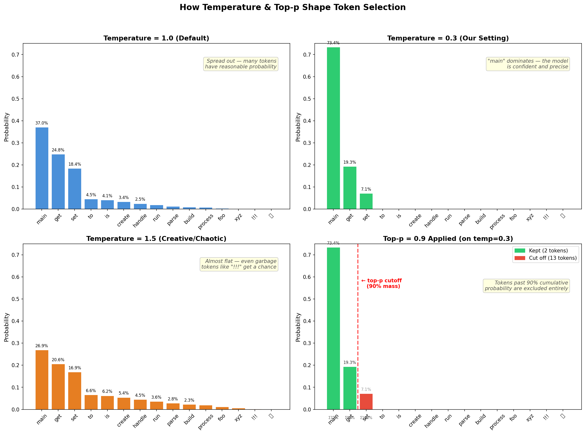

# Sampling Parameters: Temperature & Top-p

How `temperature` and `top_p` in our Modelfile control which tokens the model picks.

## The Problem

After processing your prompt, the model produces a probability distribution over all possible next tokens. Without tuning, it might pick unlikely tokens that produce broken or nonsensical code.

## Temperature (ours: 0.3)

Temperature **reshapes** the probability curve before sampling. It's applied to the raw logits (unnormalized scores) before the softmax function converts them to probabilities.

- **1.0 (default):** Probabilities stay as the model computed them. Many tokens share the probability mass.
- **0.3 (our setting):** The curve sharpens dramatically. Top candidates dominate; unlikely tokens become near-zero.
- **1.5 (creative):** The curve flattens. Even low-scoring tokens get meaningful probability. Good for stories, bad for code.

Mathematically: `softmax(logits / temperature)`. Lower temperature amplifies differences between scores.

## Top-p / Nucleus Sampling (ours: 0.9)

Top-p **prunes** the distribution after temperature is applied. It sorts tokens by probability, walks down from the most likely, and cuts off everything after cumulative probability reaches `p`.

- **0.9** means: keep the smallest set of tokens whose combined probability is at least 90%. Everything else gets zero probability.
- This eliminates the "long tail" of garbage tokens entirely, regardless of temperature.

## Why Both?

They form a two-stage funnel:

1. **Temperature** concentrates probability mass on the best candidates (reshaping)
2. **Top-p** removes the remaining long tail entirely (pruning)

With `temperature=0.3` + `top_p=0.9`, the model is both **confident** (picks the best token) and **safe** (can't accidentally choose nonsense).

## Visual Reference

The chart shows a simulated scenario where the model chooses the next token after `public static void`:

| Quadrant | Setting | Effect |
|----------|---------|--------|
| Top-left | temp=1.0 | Spread out — many tokens viable |
| Top-right | temp=0.3 | Sharp peak — `main` dominates at ~64% |
| Bottom-left | temp=1.5 | Nearly flat — even garbage tokens get chances |
| Bottom-right | top_p=0.9 on temp=0.3 | Only 2 tokens survive; 13 pruned entirely |
