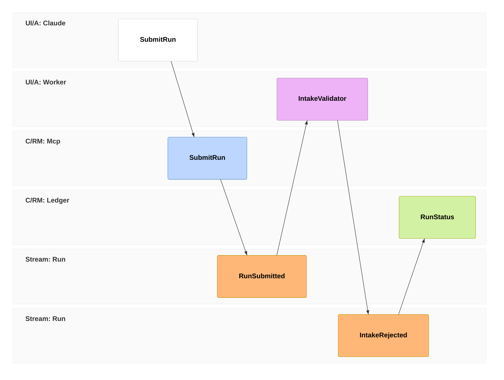
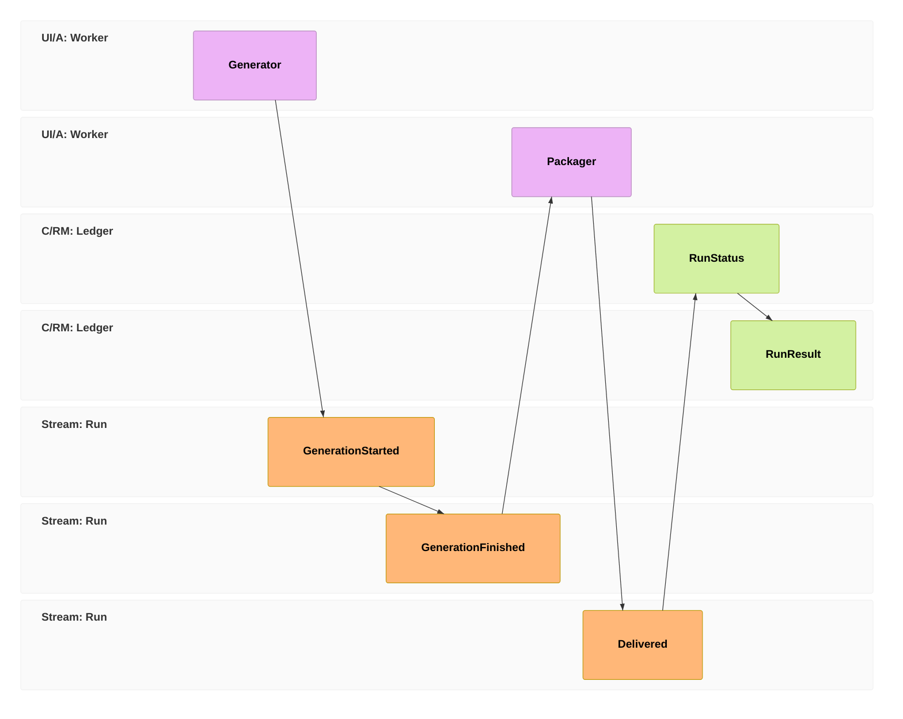
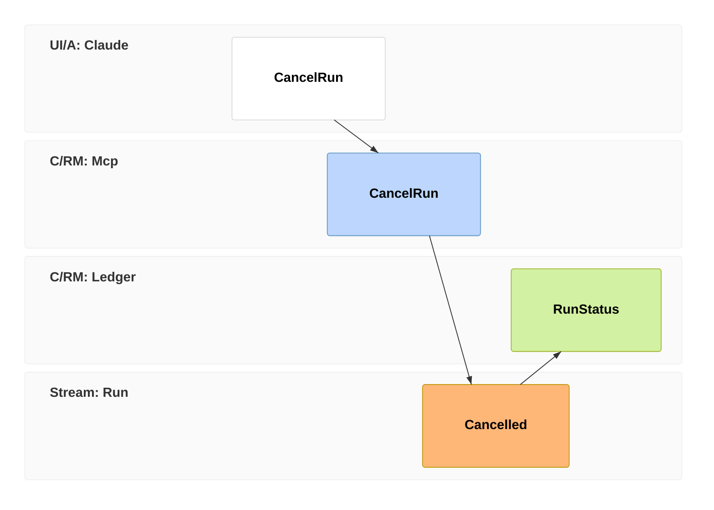
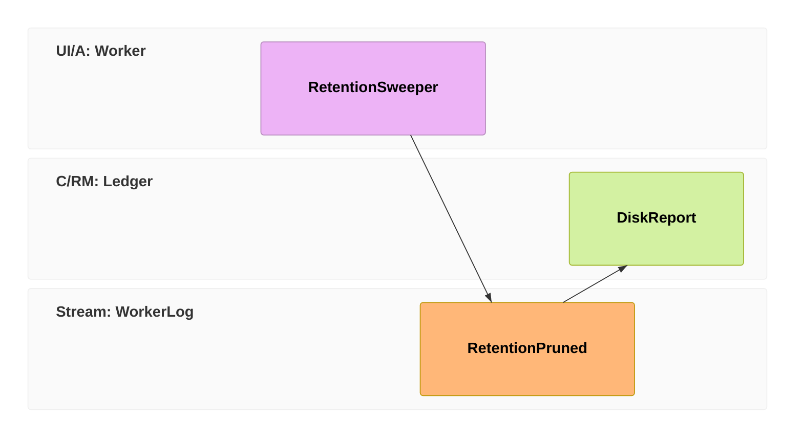
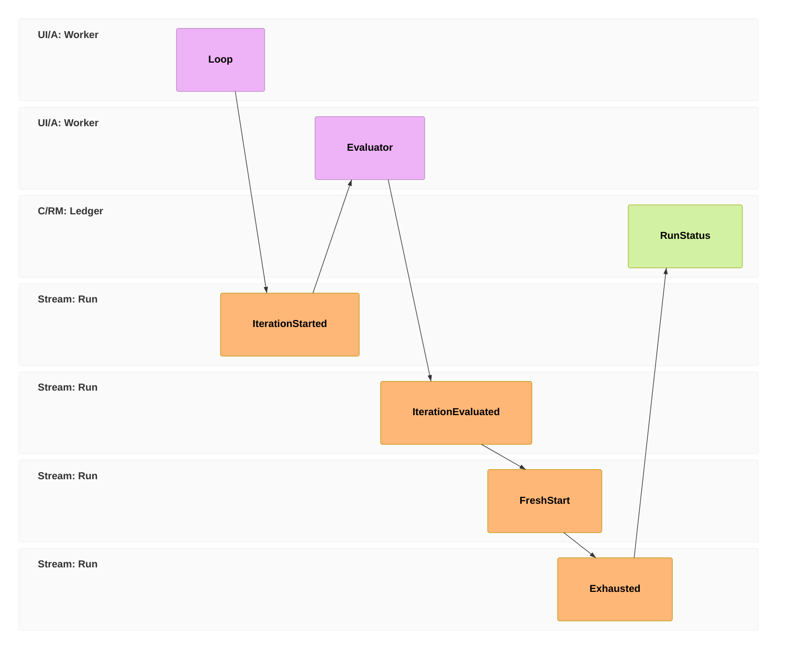
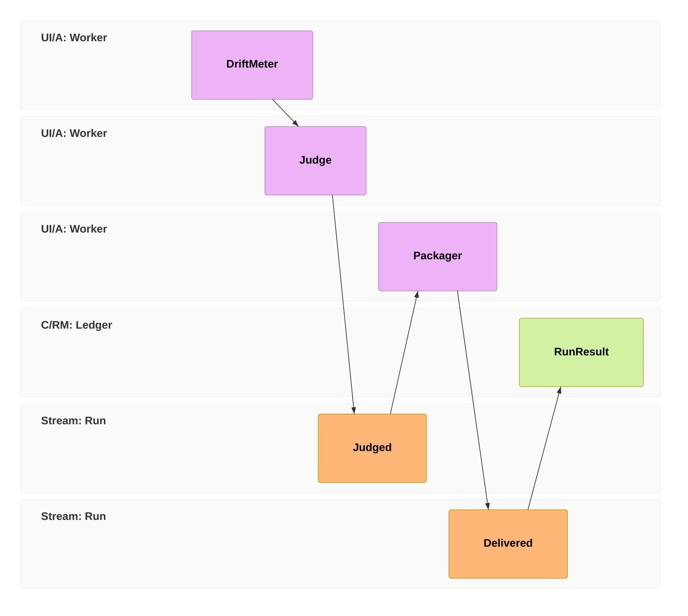

# Event model — oficina run ledger

*The evolving event-model artifact for the deliverable-run system (V-D1: oficina). Authored
2026-07-11 during T-84 pre-planning. This file is the place where event vocabulary churns
cheaply — BEFORE names hit the wire. Each phase plan revises this artifact first, then
promotes its events to frozen.*

**Medium:** Mermaid's native `eventmodeling` diagram type (v11.15.0+), chosen 2026-07-11 —
see "Medium decision" at the bottom for the alternatives record. Source of truth is this
markdown file; render to SVG on demand with `npx -y @mermaid-js/mermaid-cli -i <file>`
(local VS Code / GitHub Mermaid renderers may lag the 11.15 syntax — the text is the artifact).

**Notation:** `tf NN <type> Namespace.Entity` — types: `ui` / `cmd` (command) / `evt` (event)
/ `rmo` (read model) / `pcr` (processor). Swimlanes derive from each `Namespace` + type
combination. Relations between consecutive timeframes are inferred from sequence; `->>` marks
multi-source relations; `rf` (reset frame) breaks inference between slices.

---

<!-- ref:delegate-event-model -->
## Event vocabulary (status column is the freeze ladder)

Status values: **frozen** (wire format, changing it is a breaking change) · **freeze-at-P1**
(the P1 plan's freeze candidate set) · **draft-PN** (modeled now, promoted by phase N's plan).

### Envelope (freeze-at-P1 — this is what `run_status(since_offset)` actually depends on)

Every ledger line: `{offset, ts, event, payload}` — `run_id` is implicit in the file path
(`runs/<id>/events.jsonl`). Status is a fold over `event` names; unknown event names MUST be
tolerated by folds (forward compatibility — this is what lets draft events land later without
breaking P1 clients).

### Run-ledger events

| Event | Status | Emitted by | Notes |
|---|---|---|---|
| `RunSubmitted` | freeze-at-P1 | MCP surface | Spec persisted, run queued (FIFO position in payload) |
| `IntakeRejected` | freeze-at-P1 | Worker (intake) | Deterministic spec rejection; payload = which rule, terminal |
| `GenerationStarted` | freeze-at-P1 | Worker | Model + persona resolved; cold-start grace applied here |
| `GenerationFinished` | freeze-at-P1 | Worker | Payload: eval_count, duration (mirrors calls.jsonl fields). **+`call_id` (P4-T3, session 131)** — `calls.jsonl` gained `call_id` in T-105, and carrying it here makes the ledger↔calls join **identity-based**. Without it the join is per-`run_id` only, so per-iteration matching is order-based — the positional fallback T-105 banned (*"mislabeled is worse than missing"*). Closes T-99's "revisit the join mechanics at P4" |
| `Delivered` | freeze-at-P1 | Worker (packaging) | Terminal; payload carries the **report inline** plus the deliverable location. The report is `Delivered`-payload-resident **by design, not in `artifacts/`** — that is what keeps `run_result` answerable after retention prunes the workspace (`service.result()` reads `delivered.get("report")`). **P4 extends the report additively** with the P4-D3 drift metrics (`hunks`, `lines_added`/`lines_removed`, `files_touched`, `max_verbatim_run_vs_tests`) and the judge outcome. Additive payload growth is not a wire break — readers use `dict.get()` — but **compactness is a hard constraint here**: this payload is paid for in Claude's context on every `run_result`, with no pointer indirection to hide behind, so metrics are numbers and ranges and the diff itself is never inlined (reconstructible from the run branch, pinned by `refs/oficina/<run_id>`, T-118 R-D2) |
| `Failed` | freeze-at-P1 | Worker (any stage) | Terminal; payload = where/whose/what triad |
| `Cancelled` | freeze-at-P1 | Worker (cooperative) | Terminal; checked between model calls |
| `AssemblyDone` | **frozen-P2** (T6, session 120) | Worker (assembly) | `{worktree_path, base_commit, test_files_materialized, baseline_failure_count}` — repurposed for P2's non-trivial worktree assembly (P2-D13) |
| `IterationStarted` | **frozen-P2** (T6, session 120) | Worker (loop) | `{iteration, tier, budget_remaining:{iterations, fresh_starts}}` |
| `IterationEvaluated` | **frozen-P2** (T6, session 120) | Worker (loop) | `{iteration, passed, stage_failed, failure_class, error_keys, auto_verdict}` — folds to `working` |
| `FreshStart` | **frozen-P2** (T6, session 120) | Worker (loop) | `{iteration, signature, reason:"repetition"}` — P2-D7 |
| `ModelEscalated` | frozen-P2 vocab (emitter exists; **not emitted in the first slice**, P2-D1 no ladder) | Worker (loop) | `{from_tier, to_tier, from_persona, to_persona, reason}` |
| `Exhausted` | **frozen-P2** (T6, session 120) | Worker (loop) | `{spent, limit_hit, best_attempt_ref}` — maps to public `failed`, best attempt attached (NOT Delivered) |
| `ContextLimitUnknown` | **frozen-P2** (T-112, session 129) | Worker (loop) | `{model}` — the input-fit guard could not resolve the model's `num_ctx`, so it is NOT running for this run. **Does not fold**: it is absent from `_STATE_BY_EVENT`, so state is unchanged (the documented unknown-name tolerance). Informational sibling of `RefsDropped`, but on the **run** ledger rather than the worker ledger, because the point is that the guard's absence is visible to whoever reads the run (`run_status`), never inferred |
| `Judged` | **frozen-P4** (session 131) | Worker (packaging) | `{rubric, model, passed, judge_verdict, criteria:[{name, score}]}` — the Phase-2 rubric judge, run **once at packaging** (P4-D1; `ref:delegate-evidence-dpo` prices it there: *"one judge call per delivered run, not per iteration"*). **Renamed from the drafted `JudgePassed`/`JudgeFailed` pair** to match this file's own built precedent — `IterationEvaluated` carries `passed: bool` rather than splitting into two names, and a pair would need two fold rows doing identical work. **Does not fold** (like `ContextLimitUnknown`): the run is `working` before and after. **`passed: false` does NOT block `Delivered`** — S17 gates *DPO chosen labels*, not delivery, and H1 is Claude-gated by design (`ref:delegate-non-goals`: "not a replacement for Claude's judgment"). `judge_verdict` is the third verdict field, distinct from `auto_verdict` (ledger-only, binary) and `curated_verdict` (per-run, via `run_result`) |
| `ApprovalRequested` | **draft-P5** (re-tagged session 131, was `draft-P4`) | Worker (post-assembly) | The approval gate (S14) → public state `input_required`. **Moved to P5 so it ships with the verb that resumes it:** `answer_run` is P5, so a P4-built gate could enter a state nothing could clear. P4 ships the `approval_gate` spec key and **rejects `true` at intake** naming P5 — recognized, never silently ignored |
| `QuestionRaised` | draft-P5 | Worker (any model stage) | Model `blocked` escape → `input_required` |
| `AnswerReceived` | draft-P5 | MCP surface (`answer_run`) | Resumes the run |

### Worker-ledger events (worker-level `events.jsonl`, not per-run — per-run ledgers do not grow after terminal state)

| Event | Status | Emitted by | Notes |
|---|---|---|---|
| `WorkerStarted` / `WorkerStopped` | freeze-at-P1 | Worker | Crash forensics anchor |
| `RetentionPruned` | freeze-at-P1 | Worker (retention pass) | V-D9 observability: what was removed, bytes freed, which policy fired. Silence = nothing pruned |
| `RefsDropped` | freeze-at-P1 | Worker (refs resolution) | `{run_id, refs, reason}` — a requested `context.refs` block that could not be resolved; the run proceeds without it (T-96 fail-loud-by-record). *Was live in `ledger.py` from session 123 but undocumented here until session 129.* |

### Public state fold (MCP Tasks vocabulary, S6)

`queued → working → completed | failed | cancelled` (+ `input_required` from P4/P5 events).
Internal phase within `working` is also a fold: latest of intake/assembling/looping/packaging
markers. The fold, not the worker, owns state — there is no separately-tracked status field
to drift (first-principles #6).
<!-- /ref:delegate-event-model -->

---

## Slices (P1 — freeze candidates)

### Slice: submit → intake

Reading: Claude (the `ui` lane — the MCP client) issues `SubmitRun`; the MCP surface
validates shape and persists `RunSubmitted`; the worker's intake validator applies the
deterministic rejection rules (`ref:delegate-run-spec`); rejection is an event, acceptance is
silent — the accepted path is visible as `GenerationStarted` in the next slice. `RunStatus`
is the fold every `run_status` poll reads.

### Slice: generate → deliver (P1 has no loop — this is the whole middle)

`RunResult` is the read model behind `run_result` — report + deliverable location; it stays
resolvable after workspace artifacts are pruned (V-D9).

### Slice: cancel (any non-terminal point)

Cooperative: the command sets a flag; the worker emits `Cancelled` at the next check between
model calls. The gap between command and event is real and visible in the ledger — by design.

### Slice: retention (worker ledger — V-D9)

`DiskReport` backs `oficina runs` (per-run footprint, prune eligibility) and
`oficina prune --dry-run` (what would fire).

## Slices (P2 — draft, revise at P2 plan time)

### Slice: the evaluated loop

Semantics: `IterationEvaluated` carries the failure classification and auto-verdict;
repetition signature fires `FreshStart`; budget exhaustion emits **`Exhausted` as its own
terminal event**, mapping to public `failed` with the best attempt attached — it does **NOT**
emit `Delivered`.

> **CORRECTED session 124 (2026-07-18).** This paragraph previously read *"emits `Exhausted` and
> then `Delivered` (degraded, best attempt) — exhaustion is a quality of the delivery, not a
> different terminal state"*, contradicting **the table at the top of this same file** (row
> `Exhausted`: *"maps to public `failed`… (NOT Delivered)"*). The as-built code is the authority:
> the loop emits `Exhausted` and the worker owns `Delivered` separately (T6/T7, session 120), and
> session 121 made `Exhausted` a first-class terminal surfaced by `service.result()`, the phase
> map, and the runs-scan hook. The degraded-delivery framing was a P2-draft idea that did not
> survive the freeze.

## Slice (P4 — modeled session 131, its plan is open)

### Slice: package → measure → judge → deliver

**The two processors are the whole point, and their order is load-bearing.** `DriftMeter` is the
**mechanical** layer: it measures *magnitude* — hunk count and ranges, lines added/removed, files
touched, longest verbatim run against the declared `test_files` — which is reference-checkable and
costs nothing (`evaluator/README.md`: Phase 1 is deterministic, free, no model required). `Judge`
is the **judging** layer: it classifies *scope* — whether the change matches what was asked — which
has no reference to check against and is genuinely a judgment.

That split is T-119's resolution (`ref:active-decisions`, session 130): **the free layer surfaces,
the judging layer classifies.** The alternative — one mechanical detector per observed drift face —
is a ratchet, because T-119 (content added) and E-D6 (docstring deleted) are two faces of one
family, *unrequested change*. Measuring first also means the judge is handed numbers rather than
asked to compute them, which matters on a 7–8B-class rubric judge.

`Judged` does not change public state; `Delivered` remains the terminal the Packager owns (T7).

P3, P5 and P6 slices (assembly/context requests, question channel, flywheel) stay vocabulary-only —
see the table; model them as slices when their phase plans open.

---

## Medium decision & alternatives record (research 2026-07-11, Sonnet agent)

**Pick: Mermaid `eventmodeling` (v11.15.0+), text-in-repo.** Only surveyed option scoring top
marks on all five criteria (git-diffable / AI-authorable / viewable / zero-infra / actual
event-modeling notation). Caveat: renderer lag — VS Code's bundled Mermaid was 11.12 at
decision time; render via `mmdc` (npx) or mermaid.live until it catches up.

**Runner-up: Excalidraw** — `.excalidraw` JSON in repo + community MCP server
(`yctimlin/mcp_excalidraw`, draw→screenshot→refine loop) + VS Code extension. Use IF a
freeform whiteboard session is ever genuinely needed (many branching policies, annotation-heavy
working sessions); complement, not replacement. Costs: noisy JSON diffs, no built-in notation.

**Miro: rejected** despite an official MCP server (shipped Feb 2026). A board is not a file —
fails git-versionability outright; user-heard complaints corroborated (seat/billing traps,
AI-credit metering).

**EventCatalog (event-catalog/eventcatalog): watch-item — ANSWERED at P4, still no (session 131).**
Markdown-native event *dictionary* (per-event pages: schema, producers, consumers → static docs
site; markets itself as docs "for AI agents"). Wrong tool for the modeling timeline; plausibly the
right tool for documenting the frozen vocabulary once P1 ships. The trigger fired — P4 is the
delivery-report phase — so it is answered rather than left standing.

**Verdict: no, and the trigger is re-armed rather than retired.** Three reasons. (1) The vocabulary
is **17 events in one table** that fits on a screen; a static site per event would be a strictly
worse index than the table plus this file's freeze-ladder column. (2) There is still **no external
consumer** — the second half of the original trigger never fired, and every reader is either this
repo or an agent that greps markdown. (3) The delivery report is a **per-run narrative**, not an
event schema, so P4 did not create the need the tool serves.
**Re-armed trigger, now the only one:** a **first external consumer** — a second repo or a
non-Claude client reading this vocabulary. Volume alone should not re-open it; a bigger table is
still a table.

**evml (lgazo/event-modeling-tools): watch-item.** Purpose-built event-modeling DSL with VS
Code/Obsidian plugins — exactly the right notation, but early-stage (13 stars, no releases);
too risky for a durable artifact today. Re-check if Mermaid's grammar proves cramped.

**D2 / PlantUML / Structurizr / tldraw / draw.io: rejected** — respectively: no swimlanes yet
(D2 #236); no event-model notation; wrong abstraction (C4); MCP-for-Claude rollout immature;
XML fussy for AI authoring with no notation gain.
